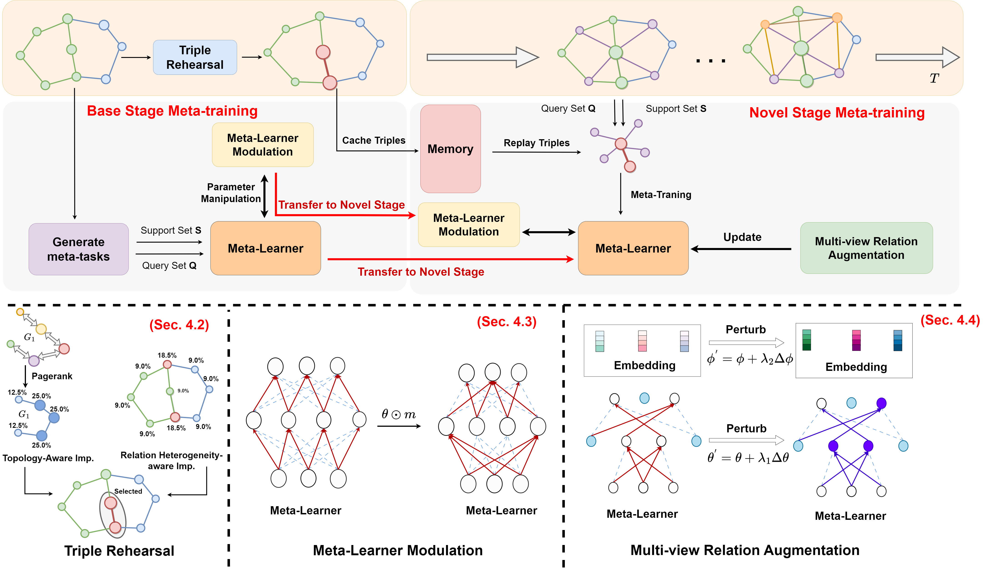

# Continual Few-shot Knowledge Graph Completion
This repo shows the source code of paper: **Continual Few-shot Knowledge Graph Completion**. In this paper, we propose a novel framework designed to equip the few-shot model with the ability to learn sequentially from novel relations. Specifically, we introduce innovative strategies at
both the data and model levels: **data-level rehearsal** and **model-level
modulation** to address catastrophic forgetting, alongside **multi-view
relation augmentation** aimed at resolving the issue of insufficient
novel relations.


## Running the Experiments
## Requirements
Install dependencies by
```bash
pip install -r requirements.txt
```
## Dataset
We use NELL-One and Wiki-One to test our model. The orginal datasets and pretrain embeddings can be downloaded from [xiong's repo](https://github.com/xwhan/One-shot-Relational-Learning). We select what we need to meet our continual few-shot setting, please check [cfkgc-datasets]() for more details. 

## Training
